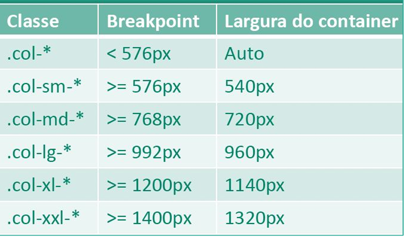

# Fundamentos do Bootstrap

## Menu
[Aula 1 - Conheça o Bootstrap](#aula-1---conheça-o-bootstrap)  
[Aula 2 - Grids](#aula-2---grids)  
[Aula 3 - Tipografia](#aula-3---tipografia)
[Aula 4 - Tabelas](#aula-4---tabelas)
[Aula 5 - Botões](#aula-5---botões)
[Aula 6 - Accordions](#aula-6---accordions)
[Aula 7 - Collapse](#aula-7---collapse)
[Aula 8 - Alertas](#aula-8---alertas)

## Aula 1 - Conheça o Bootstrap

**Framework** → Um framework é uma estrutura reutilizável composta por bibliotecas, padrões e ferramentas que auxiliam desenvolvedores a criar aplicações de forma mais rápida, organizada, padronizada, segura e eficiente.

> "Porções de código que alguém já escreveu, com componentes que podemos reutilizar para construir botões, formulários, campos de alerta e outras coisas."

Para adicionar o Bootstrap ao seu projeto, basta incluir este comando:

```html
<link rel="stylesheet" href="https://cdn.jsdelivr.net/npm/bootstrap@5.3.3/dist/css/bootstrap.min.css">
```

Entre no site do [Bootstrap](https://getbootstrap.com/) e acesse a documentação para ver a forma mais atualizada de como adicioná-lo ao seu projeto.

## Aula 2 - Grids

O sistema de Grids do Bootstrap é o que o tornou tão popular. Ele trabalha com **12 colunas**.

### Estrutura básica do Grid no Bootstrap:
```html
<div class="container"> <!-- Onde vai ficar o conteúdo -->
    <div class="row"> <!-- As linhas -->
        <div class="col"> <!-- Colunas, o máximo são 12 -->
            
        </div>
    </div>
</div>
```

Se colocarmos um sufixo na classe `col`, como `col-(1 a 12)`, já podemos ir construindo a estrutura do site e definindo como as informações serão apresentadas.

### Breakpoints e responsividade:
O Bootstrap possui categorias com **breakpoints** diferentes, possibilitando criar um CSS responsivo apenas com suas classes.



- `col-lg-8` → Em telas maiores, o conteúdo ocupa 8 colunas das 12.
- `col-sm-12` → Em telas menores, o conteúdo ocupa todas as colunas disponíveis.
- `g-0` → Remove o espaçamento entre as colunas.

### Dica com Emmet:
```emmet
.container>.row>.col*5>img+h3
```
Esse atalho cria rapidamente uma estrutura com 5 colunas, cada uma contendo uma imagem (``) e um título (`<h3>`).

#### Explicação dos atalhos:
- `.a>.b` → Classe `a` é pai da classe `b`
- `.b>.c*5` → Classe `b` é pai de cinco elementos com a classe `c`
- `.c>img+h3` → Cada `c` conterá uma tag `` e uma `<h3>`

### Resultado final:
```html
<div class="container">
    <div class="row">
        <div class="col">
            
            <h3></h3>
        </div>
        <div class="col">
            
            <h3></h3>
        </div>
        <div class="col">
            
            <h3></h3>
        </div>
        <div class="col">
            
            <h3></h3>
        </div>
        <div class="col">
            
            <h3></h3>
        </div>
    </div>
</div>
```

## Aula 3 - Tipografia

Nesta aula vamos falar de fontes e tipografia no Bootstrap.

O Bootstrap aplica estilos e efeitos tipográficos a diversas tags de texto como `<h1>` a `<h6>`, `<p>`, `<mark>`, entre outras.

### Principais classes:

- `h1` a `h6` → Aplicam estilos de títulos a outros elementos, como parágrafos.
- `display-1` a `display-6` → Aumentam o tamanho da fonte e reduzem o peso do traço, criando títulos de destaque.

## Aula 4 - Tabelas

Aprenderemos sobre tabelas e quais recursos o Bootstrap oferece para estilizar e organizar melhor esses elementos.

### Principais tags de uma tabela:
*(Algumas tags adicionais serão comentadas no código abaixo)*

```html
<table class="table">
    <caption>Tabela de produtos</caption> <!-- Legenda -->
    <thead> <!-- Cabeçalho - Geralmente com os títulos -->
        <tr> <!-- Linha do cabeçalho -->
            <th>Nome do produto</th> <!-- Coluna cabeçalho -->
            <th>Preço original</th>
        </tr>
    </thead>
    <tbody>
        <tr> <!-- Linha onde ficam as células de conteúdo -->
            <td>Iphone 13</td> <!-- Coluna com conteúdo -->
            <td>R$7.000,00</td>
        </tr>
    </tbody>
    <!-- <tfoot>Rodapé da tabela</tfoot> (pode ser utilizado para totais, notas ou sumários) -->
</table>
```

### Classes mais usadas para tabelas no Bootstrap:

- `table` → Define largura 100% e bordas visuais entre as linhas.
- `table-primary` → Estilo com cor primária.
- `table-secondary` → Estilo com cor secundária.
- `table-success` → Estilo com tom de sucesso (verde).
- `table-danger` → Estilo para erros ou dados negativos (vermelho).
- `table-warning` → Estilo para alertas ou atenção (amarelo).
- `table-info` → Estilo com tom informativo (azul claro).
- `table-light` → Estilo claro, acinzentado.
- `table-dark` → Estilo escuro.

### Dica:
Mesmo utilizando o Bootstrap, é importante manter um **arquivo CSS próprio** para ajustes finos no layout e personalização de estilos específicos.

## Aula 5 - Botões

A classe principal para aplicar estilo aos botões é `btn`. De forma geral, os estilos seguem um padrão semelhante ao das tabelas, mas com variações nas cores.

### Classes de estilo para botões:

- `btn-primary` → Azul
- `btn-secondary` → Cinza
- `btn-success` → Verde
- `btn-danger` → Vermelho
- `btn-warning` → Fundo amarelo com texto preto
- `btn-info` → Tom de azul claro
- `btn-light` → Cinza claro
- `btn-dark` → Preto
- `btn-link` → Aparência de um link (sem borda, azul com sublinhado)

### Botões com contorno (outline):

- `btn-outline-*` → Versão sem fundo colorido, com borda e texto na cor correspondente.

Exemplo:
```html
<button class="btn btn-outline-success">Salvar</button>
```

### Tamanhos dos botões:

- `btn-lg` → Botão grande
- `btn-md` → Botão médio (padrão)
- `btn-sm` → Botão pequeno

> Lembre-se de sempre usar `btn` junto com qualquer uma dessas classes para o estilo funcionar corretamente:

```html
<button class="btn btn-primary btn-lg">Clique aqui</button>
```

## Aula 6 - Accordions

Nesta aula vamos aprender a trabalhar com accordions, mas para isso precisamos adicionar ao nosso `HTML` o JavaScript do Bootstrap.

```html
<script src="https://cdn.jsdelivr.net/npm/bootstrap@5.3.3/dist/js/bootstrap.bundle.min.js"></script>
```

Esta é a forma que está em vigor atualmente (26/03/2025). Por via das dúvidas, entre no site do [Bootstrap](https://getbootstrap.com/) e acesse a documentação para ver a forma mais atualizada de como adicioná-lo ao seu projeto.

### Estrutura do Accordion

```html
<div class="accordion"> <!-- Vai englobar toda a estrutura, como se fosse um <ul> -->
  <div class="accordion-item"> <!-- Como se fosse o <li>, com uma estrutura mais personalizada -->
    <div class="accordion-header"> <!-- Container do título, onde ficará a pergunta -->
      <button class="accordion-button" data-bs-toggle="collapse" data-bs-target="#resposta1">
        Como fazer accordions?
      </button> <!-- Botão com o texto da pergunta, com função de alternar mostrar/ocultar a resposta -->
    </div>
    <div id="resposta1" class="accordion-collapse collapse show"> <!-- Alvo da ação do botão. A classe 'show' faz com que a resposta apareça por padrão. Para iniciar recolhido, remova a classe 'show'. -->
      <div class="accordion-body">
        Resposta da pergunta
      </div>
    </div>
  </div>
</div>
```

### Análise com JavaScript

```js
document.querySelector('button')
// <button class="accordion-button" data-bs-toggle="collapse" data-bs-target="#resposta1">...</button>

document.querySelector('button').dataset
// DOMStringMap { bsToggle: 'collapse', bsTarget: '#resposta1' }
```

### Observação sobre atributos personalizados

No final da aula, o professor explicou sobre a possibilidade de criação de **atributos customizados** (por exemplo, `data-ebac="btn-teste"`), que podem:

- Ajudar na **identificação de elementos**;
- Servir como **ponte entre o frontend e o backend**;
- Deixar o código mais **organizado e semântico**.

> **Atenção:** nunca coloque **informações sensíveis** nesses atributos, pois eles podem ser acessados pelo cliente através do navegador.

Esses atributos personalizados funcionam de forma similar ao `data-bs-*`, que é exatamente como o Bootstrap adiciona interatividade aos elementos HTML sem que você precise escrever JavaScript manualmente.

## Aula 7 - Collapse

Nesta aula vamos adicionar o efeito **collapse**, para mostrar ou esconder informações, só que dessa vez usando um **botão**.

### Exemplo de estrutura:

```html
<button class="btn btn-primary" data-bs-toggle="collapse" data-bs-target="#preco">
  Ver preço
</button>

<div id="preco" class="collapse collapse-horizontal"> <!-- 'collapse-horizontal' faz o elemento expandir da esquerda para a direita. Sem ele, o comportamento padrão é de cima para baixo. -->
  <p>
    3 x de R$300,00
  </p>
</div>
```

Esse botão tem uma interação parecida com o accordion: ao clicar, a informação é exibida ou ocultada.

---

### Estilização com CSS

```css
#preco p {
  width: 300px;
}
```

Esse CSS foi usado para organizar a forma como o texto era apresentado. Antes, ele ocupava mais de três linhas; depois da alteração, passou a ocupar apenas **uma linha**, deixando a interface mais limpa e organizada.

## Aula 8 - Alertas

Vamos aprender a criar alertas e mensagens com o Bootstrap. Basicamente, aprendemos a fazer um tipo de **pop-up** informativo.

### Exemplo de Alerta:

```html
<div class="alert alert-dark alert-dismissible"> <!-- Cria um alerta + cor cinza escuro + organização visual -->
  <button class="btn-close" data-bs-dismiss="alert"></button> <!-- Botão de fechar com função de remover o alerta -->
  Sou uma mensagem de informação
</div>
```

Dessa forma, criamos um alerta no Bootstrap. A classe `alert-dismissible` garante que o alerta tenha espaçamento e estilo apropriado para um botão de fechamento, enquanto `data-bs-dismiss="alert"` ativa a funcionalidade de fechar o alerta ao clicar no botão.

### Variações de cores de alerta:

- `alert-primary` → Azul
- `alert-secondary` → Cinza
- `alert-info` → Azul claro
- `alert-danger` → Vermelho
- `alert-warning` → Amarelo
- `alert-success` → Verde
- `alert-dark` → Cinza escuro
- `alert-light` → Cinza claro

Cada uma dessas classes altera a cor e o estilo do alerta para se adequar ao tipo de mensagem (sucesso, erro, informação, etc).